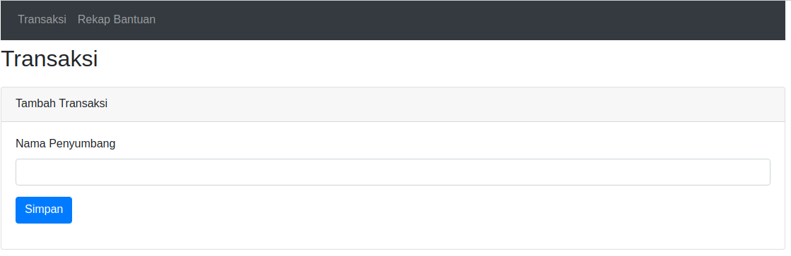
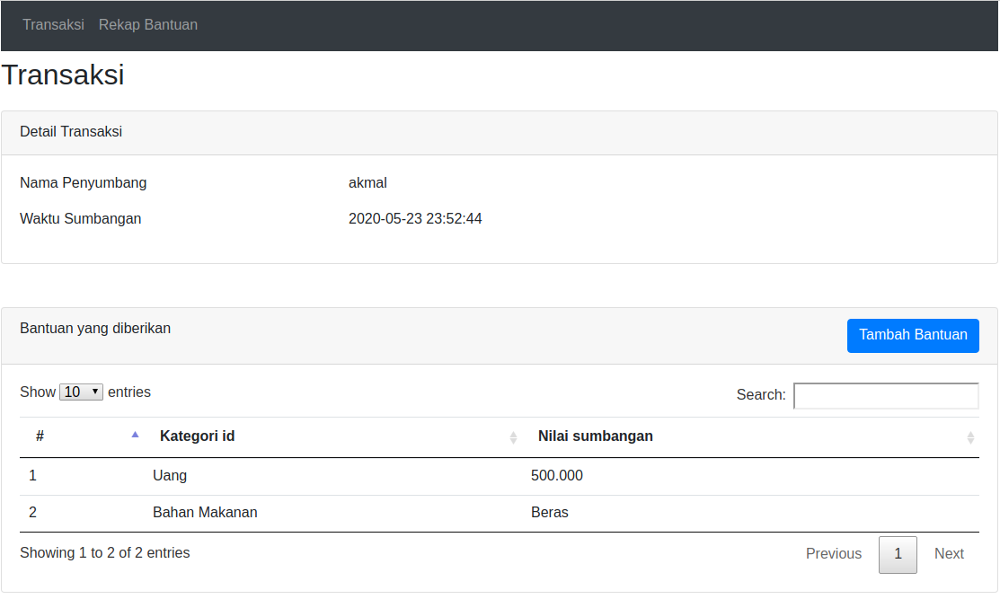
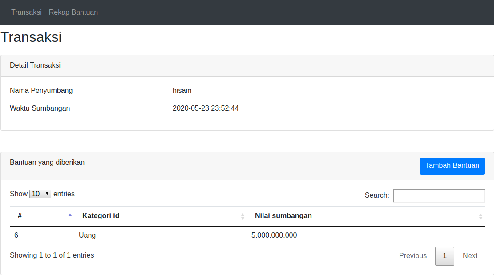

# FP_PBKK

Nama 	: M Akmal Fakhri Baihaqi
NRP 	: 05111740000188
Class	: PBKK - E

Deskripsi Aplikasi
Aplikasi ini bertujuan untuk melakukan pendataan bantuan selama Pandemi Covid-19.

Pada aplikasi ini memiliki beberapa fitur yaitu:

# A. Menambah Transaksi
Pada fitur ini kita dapat mencatat siapa nama penyumbang, kapan sumbangan di lakukan.

# B. Menambah Bantuan
Pada fitur ini kita menambahkan informasi berupa bantuan apa yang disumbangkan dari transaksi tersebut.

# C. Melihat Daftar Transaksi
Pada fitur ini kita bisa melihat Transaksi apa saja yang sudah di lakukan

# D. Melihat Detail Transaksi
Pada fitur ini kita bisa melihat siapa nama penyumbang, kapan sumbangan di lakukan, dan daftar bantuan yang telah di berikan.

# E. Melihat Rekap Bantuan
Pada fitur ini kita bisa melihat rekap bantuan berdasarkan kategori bantuannya.

## Contoh Input Bantuan
Setelah hisam menambah daftar transaksi, hisam menambahkan jenis dan nilai bantuan yang akan diberikan, maka bantuan tersebut akan terlihat pada gambar ke 3.

